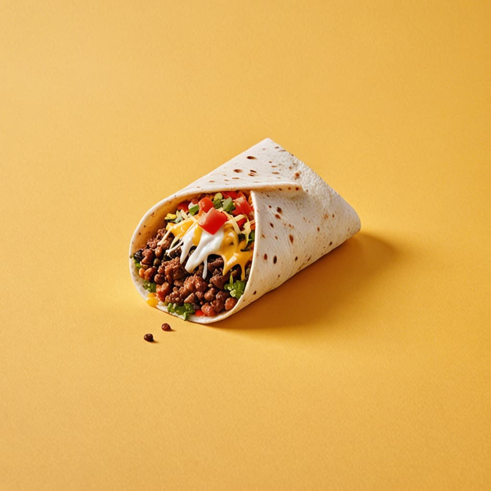

<!-- Short Description & Site Link -->

    <h3>
        This is a Game Development course by GameDev.tv <a href="https://www.gamedev.tv/" target="_blank" alt="Link to GameDev.tvs Website">GameDev.tv</a>
    </h3>
     
<!-- Site Logo & Link -->
    
     
<!-- Course Full Name & Link to Specific Course -->
    <h4>
        <a href="https://www.gamedev.tv/courses/unity-complete-2d" alt="Link to the related GameDev.tv course" target="_blank">COMPLETE UNITY 2D DEVELOPER: CREATE YOUR OWN 2D GAMES USING UNITY C#</a>
    </h4>

 

<!-- Short description about the repository -->
#### • ABOUT
## What is the repository all about?

This repository is dedicated to exploring game development with Unity, specifically tailored for beginners. It focuses on creating 2D games using C#.

You’ll find links to my course notes organized by sections, labeled as section_( 1--9 ).md, and assets related to each lecture stored in their respective folders within the root assets folder.

 

<!-- Tree/Blob view of the files found within this repo -->
#### • NOTE LINKS
## This is where you can find links to everything in this repo

 

- [assets/](./assets/)
    - [images/](./assets/images/)
        - [logo/](./assets/images/logo/)
        - [profiles/](./assets/images/profiles/)
        - [S1/](./assets/images/S1/)
        - [S2/](./assets/images/S2/)
- [README.md](./README.md)
- [S1IntroductionAndSetup.md](./S1IntroductionAndSetup.md)
- [S2DeliveryDriver.md](./S2DeliveryDriver.md)

 

<!-- Info on who work on this project and sources (if any) -->
#### • CREDITS & SOURCES
## Those who worked on the project & various source information

##### • USER PROFILES

    

##### • SOURCES