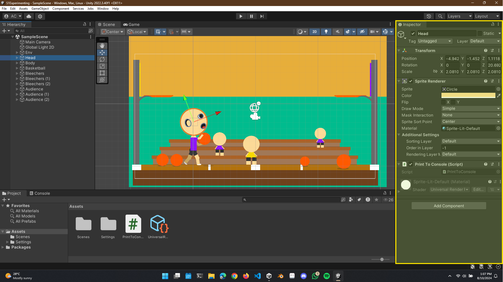

<div align="center">
    <!-- Section Heading -->
    <hr>
    <h3>
        S1 : INTRODUCTION & SETUP
    </h3>
    <hr>
</div>

### Introduction

In this section, we learned how to download and set up both [Unity](https://unity.com/ 'Link to Unity Website') and [Visual Studio Code](https://code.visualstudio.com/ 'Link to Microsoft Visual Studio Code'). This process included configuring Unity's preferences to use Visual Studio Code as the primary code editor.

<br>
<br>

### Interface
#### Inspector Window Pane
<hr>
<br>

Within Unity, we explored the various sections of the interface and how to reset the interface back to default within the **Window** > **layouts** tab. Looking the Inspector pane, this is where we learned about different components and how to view and manipulate various properties such as the X, Y, Z coordinates, the color of sprites, and the Z index (or order in layer) property, which determines whether an object appears above or below another object.

<br>



<br>

#### Hierarchy Window Pane
<hr>
<br>

We also explored the Hierarchy pane, which displays various objects in the scene, such as the camera and sprites. Additionally, we learned how to add objects to the scene by right-clicking in the Hierarchy, selecting **2D Object**, then **Sprites[^1]**, and choosing the desired shape.

<br>


<br>

#### Basic Controls
<hr>
<br>

We then learned about the controls and how we can manipulate the sprites on the stage using both the interface and keyboard shortcuts as well as panning around the scene. The keyboard shortcuts do the following:

|Keyboard Shortcut|Description|Image|
|:---|:---|:---|
|ToolWindowPane|||
|**W**|Move Tool, Moves the Object.||
|**E**|Rotate Tool, Rotates the object.||
|**R**|Scale Tool, Scales the Object.||
|**T**|Rect Tool, Is like free-transform||

<br>

#### Challenge
<hr>
<br>

Shortly after, we were challenged to make a pretend platformer scene with the information we just learn't on how to create & manipulate sprites.

<br>


<br>

#### Creating a C# Script
<hr>
<br>

We then dived into creating a C# Script file with the code ```Debug.Log("...")``` and then how to run the Unity game and seeing what message is printed to the console. The way we made the script file was by right clicking inside the project asset pane and selecting **Create** > **C# Script**.

<br>


<br>

<br>
<br>

### VIsual Studio Code Extensions

Finally, we also installed Visual Studio Code Extensions (**C#**, **Unity Code Snippets**, **Unity**). 

- **C#** : ms-dotnettools.csharp
- **Unity Code Snippets** : kleber-swf.unity-code-snippets
- **Unity** : visualstudiotoolsforunity.vstuc


<br>
<br>

### 💡 Footnotes

[^1]: Sprites are 2D images or animations used in game development and other graphical applications. They are typically used to represent characters, objects, UI elements, and backgrounds in a 2D game. In the context of Unity and other game engines, sprites are a fundamental building block for creating visually rich, interactive experiences.