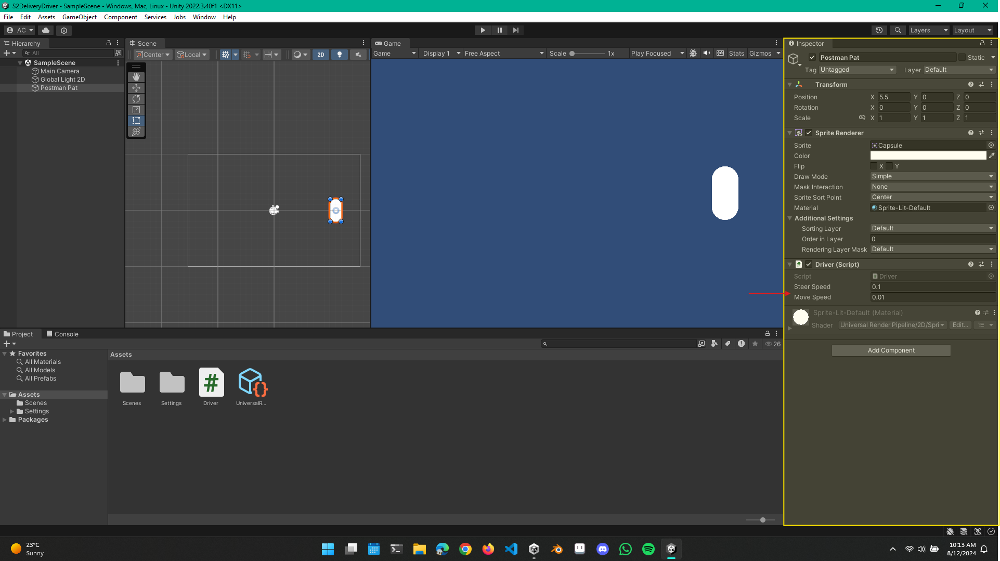

<div align="center">
    <!-- Section Heading -->
    <hr>
    <h3>
        S2 : Delivery Driver
    </h3>
    <hr>
</div>

### Lecture 2.1
#### Section intro - Delivery Driver
<hr>
<br>

In this section, we create a 2D top-down driving game where the player picks up different colored packages that, in turn, change the color of the car. The goal is to deliver these packages to their destinations.

We explore how to adjust the car's speed based on various obstacles, such as driving over boosters or bumping into objects.

This section emphasizes the core fundamentals of C# and programming, covering topics like variables, if statements, methods, triggers, colliders, and references.

### Lecture 2.2
#### Game Design
<hr>
<br>

In game design, it's important to follow some general guidelines when planning your work. A good starting point is to create a gameplay overview screen. This can be a very rough mockup, as shown in the image, to help visualize how the game will function.

#### Gameplay Overview Screen
<hr>
<br>

<br>


<br>

#### Game Mechanics
<hr>
<br>

Next, we focus on the game mechanics we need to build. This is where we start thinking about what we are programming and what we are trying to create.

For this, we need to implement the following:

- Driving forwards and backwards
- Turning left and right
- Increasing speed when driving over speed boosts
- Decreasing speed when bumping into slow-downs
- Picking up packages when driven over
- Changing the car's color to indicate status
- Delivering a package when driving over the delivery spot

In addition to game design, we also need to consider three key elements when creating a game:

- **Player Experience**  
  - This is the feeling you want the player to have while playing your game. It could be relaxing, making the player feel smart, or creating a frantic atmosphere.

- **Defining the Core Mechanic**  
  - For this game, the core mechanic is driving over pickups.

- **The Game Loop**  
  - The objective is to find and deliver all the packages to win.


#### Lecture challenge: what is your player delivering?
<hr>
<br>

You decided to quit your job and join a new company called DashDrop, where people can quickly send packages by connecting with local couriers, bypassing the traditional services that take days to deliver. However, will your package make it to it's destination in one piece?

### Lecture 2.3
#### Introducing Methods
<hr>
<br>

Starting this lecture, we will take a high-level look at what methods are. We will make a capsule sprite spin around using the `transform.Rotate(X, Y, Z)` method. Our first challenge for the start of this lecture is:


#### Lecture Challenge
<hr>
<br>

- Start a new 2D Unity project
- Add a capsule sprite (our car)
- Create a C# script called Driver
- Add the script to the capsule sprite as a component
- Rename your capsule sprite to give your car a nifty name i.e (Cruisy McDrive)

#### Methods
<hr>
<br>

Methods (also called functions) execute blocks of code that make our game perform actions. We can use the methods already available in Unity, or we can create our own custom methods.

#### Creating & Calling
<hr>
<br>

When we **create** a method, we give it a name and specify what it should do. We then **call** the method, which instructs the program to execute the method's code.

As we open our script file, we see that Unity has already placed some code there almost like boilerplate code. At the very top, there are some `using` directives, which allow us to use everything contained within the associated module or package.

We also see a public class that has been created for us. We will discuss classes in more detail later. Within this class, there are methods we can use.

Inside the public class Unity has generated, we find `void Start` and `void Update`. Above these methods, there is a comment[^1] explaining their purpose.

`void Start` and `void Update` are methods, more specifically, they are callbacks. Unity calls `Start` and `Update` when needed. `Start` runs when we click the play button in the Unity Editor, and any code within `Start` will execute. `Update` is called every frame while the game is running, allowing for continuous updates.

<br>


<br>

To start rotating the capsule in a 2D world, we need to understand which axis it will be rotating around. To determine this, head over to the Inspector pane window and experiment with rotating the object on each axis. You can also switch the view from 2D to 3D to see the third axis.

<br>

<video width="640" height="360" controls>
  <source src="./assets/images/S2/2DAnd3DView.mp4" type="video/mp4">
  Your browser does not support the video tag.
</video>

<br>

Another important consideration is to toggle the tool handle rotation to **local**. If the tool handle rotation is set to **global**, the X and Y axes will always point up and right. However, if set to **local**, the X and Y axes will align with the rotation of the Z axis, adapting to the object's orientation.

<br>

<video width="640" height="360" controls>
  <source src="./assets/images/S2/ToolHandleRotation.mp4" type="video/mp4">
  Your browser does not support the video tag.
</video>

<br>

In our script file, we use the `transform.Rotate()` method, which accepts X, Y, and Z coordinates as parameters. For example, `transform.Rotate(0, 0, 45)` means that if we place this code within the `Start` method, the capsule will rotate 45 degrees on its Z axis as soon as the game starts. This action will occur only once.

If we place this code in the `Update` method, the capsule will continuously spin based on the frames per second[^2] that your computer can handle. You may notice that the capsule spins at an excessively high speed.

To slow down the rotation, you can adjust the Z parameter to a smaller float value, like `transform.Rotate(0, 0, 0.1f)`. The `f` suffix indicates to C# that this is a floating-point number. By doing this, you'll notice that the capsule spins at a much slower pace.

<br>

<video width="640" height="360" controls>
  <source src="./assets/images/S2/ControllingSpinSpeed.mp4" type="video/mp4">
  Your browser does not support the video tag.
</video>

<br>

### Lecture 2.4
#### transform.Translate();
<hr>
<br>

In this lecture, we will move our car forward using the `transform.Translate()` method. The `.Translate(X, Y, Z)` method also accepts X, Y, and Z coordinates to determine the direction and distance of movement.

#### Lecture Challenge: Make our car move forward.

- In Update(), call transform.Translate()
- Add the x, y and z values so that our car slowly moves forward.

#### My Attempt

```C#
void Update()
    {
        transform.Rotate(0, 0, 0.1f);
        transform.Translate(0, 0.01f, 0);
    }
```

<br>

<video width="640" height="360" controls>
  <source src="./assets/images/S2/LCMakeOurCarMoveForward.mp4" type="video/mp4">
  Your browser does not support the video tag.
</video>

<br>

### Lecture 2.5
#### Introducing Variables

In this lecture, we will explore variables so that we can more easily manipulate numbers and alter the behavior of our objects. For example, if we want to adjust the speed of our car, we need to replace hard-coded values with variables to allow for dynamic changes.

Variables are like boxes that hold information. In C#, a variable also requires a type, a name, and a value, following the syntax: `type variableName = value;`. Variables help us store, manipulate, and reference information.

When naming a variable, the convention is camelCase, and we must specify the type of variable being declared. 

Some common variable types are:

- **int** (Whole Numbers)
  - `int hitPoints = 20;`
- **float** (Fractional numbers with up to 6 decimal places)
  - `float experiencePoints = 0.3f;` *The `f` at the end ensures Unity treats it as a float rather than a double.*
- **double** (Fractional numbers with up to 15 decimal places) *Rarely used*
  - `double radius = 5.75;`
- **bool** (True or false)
  - `bool isAlive = true;`
- **string** (Sequence of characters)
  - `string greeting = "Hello, World!";`

Next, we initialize the variable above the `Start` and `Update` methods, but still within the class.

#### Lecture Challenge: Create a variable

• Create a variable called moveSpeed and use that variable in your transform.Translate() method.

#### My Attempt

```C#
public class Driver : MonoBehaviour
{
    float steerSpeed = 0.1f;
    float moveSpeed = 0.01f;
    // Start is called before the first frame update
    void Start()
    {
        
    }

    // Update is called once per frame
    void Update()
    {
        transform.Rotate(0, 0, steerSpeed);
        transform.Translate(0, moveSpeed, 0);
    }
}
```

### Lecture 2.6
#### How to use SerializeField
<hr>
<br>

In this lecture, we will be serializing our variables so that we can move left and right within the Inspector. Making your variables available in the Inspector will save you a lot of time, especially if someone on your team is handling the design and doesn't want to dig around in the code.

To achieve this, we're going to use something called **SerializeField**. It will look something like this:

```csharp
[SerializeField] float steerSpeed = 0.1f;
```

<br>



<br>


### 💡 Footnotes

[^1]: To make a comment, we use two forward slashes `// this is a comment`.

[^2]: You can check the FPS in the game window by finding the tab called "Stats."